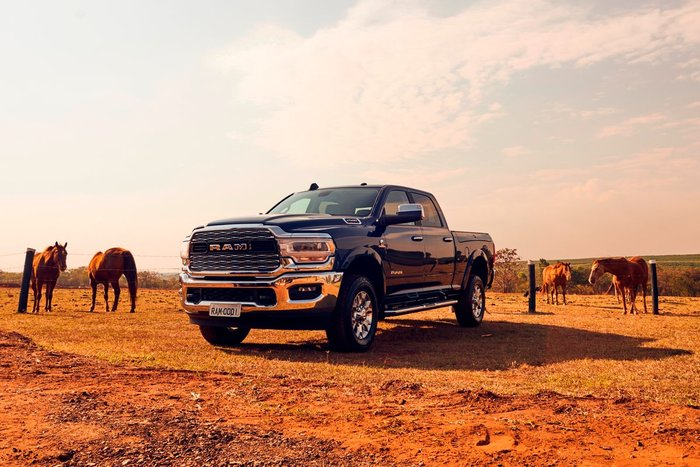

<!DOCTYPE html>
<html lang="" "pt-br"
<head>

<meta charset="UTF-8">
<title> Dodge Ram </title>
<link rel= "stylesheet href="style.css">
</head> 
<body>
<h1 id="titulo" Dodge Ram> </h1>

Tudo começou com a fabricante de veículos Chrysler, que fez grande sucesso ao chegar ao Brasil na década de 30. No entanto, devido a uma proibição de circulação e venda de veículos pré-montados, os veículos da fabricante não puderam mais ser comercializados no país, o que resultou em sua saída do mercado brasileiro.

 A partir dos anos 2000, a empresa responsável decidiu importar as caminhonetes, e foi aí que Dodge e Ram começaram a fazer sucesso com os veículos importados. Com a aceitação positiva por parte dos motoristas, a empresa optou por fabricar um produto próprio no Brasil, a Ram 2500, solidificando sua presença no mercado nacional.
</body>
</html>

 Tudo começou com a fabricante de veículos Chrysler, que fez grande sucesso ao chegar ao Brasil na década de 30. No entanto, devido a uma proibição de circulação e venda de veículos pré-montados, os veículos da fabricante não puderam mais ser comercializados no país, o que resultou em sua saída do mercado brasileiro.

 A partir dos anos 2000, a empresa responsável decidiu importar as caminhonetes, e foi aí que Dodge e Ram começaram a fazer sucesso com os veículos importados. Com a aceitação positiva por parte dos motoristas, a empresa optou por fabricar um produto próprio no Brasil, a Ram 2500, solidificando sua presença no mercado nacional.

<h1> Dodge Ram <h1/>
